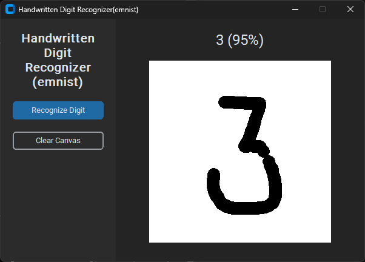
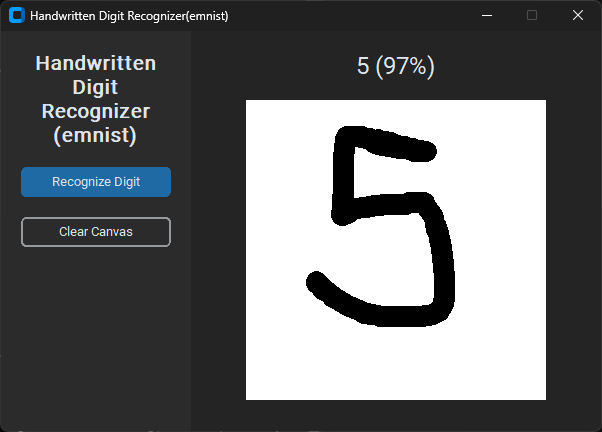
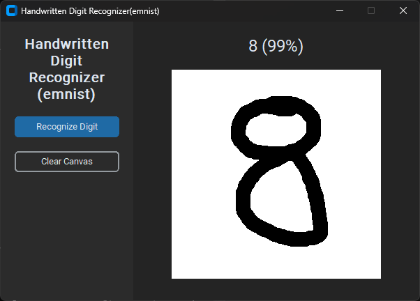

# Handwritten Digit Recognition System

A machine learning project that recognizes handwritten digits using a Convolutional Neural Network (CNN) and allows real-time prediction through a Python-based graphical user interface.

---

## Project Overview

This project implements an end-to-end handwritten digit recognition system.  
A CNN model is trained on the MNIST and EMNIST digit datasets and is integrated into a desktop GUI where users can draw digits and receive instant predictions.

The goal of this project is to understand the complete machine learning pipeline, including data preprocessing, model training, evaluation, and deployment in a user-facing application.

---

## Technologies Used

| Category            | Technology / Tool                     |
|---------------------|----------------------------------------|
| Programming Language | Python                                 |
| Deep Learning        | TensorFlow, Keras                      |
| Numerical Computing  | NumPy                                  |
| Image Processing     | Pillow (PIL)                           |
| GUI Framework        | Tkinter                                |
| Dataset              | EMNIST (Digits)                 |
| Model Type           | Convolutional Neural Network (CNN)     |
| Development Platform | Windows                                |


---

## How It Works

1. The CNN model is trained on preprocessed handwritten digit images.
2. Image preprocessing includes grayscale conversion, normalization, and orientation correction.
3. A GUI allows users to draw digits using a mouse.
4. The drawn digit is processed and passed to the trained model.
5. The model predicts the digit and displays the result in real time.

---

## GUI Preview

The application provides a simple drawing canvas where users can input handwritten digits and view predictions instantly.

 <br>

 <br>

 <br>

 <br>


---

## How to Run the Project

### 1. Clone the repository
```bash
git clone https://github.com/Kartik-Kumar9/Handwritten-Digit-Recognizer-.git
cd Handwritten-Digit-Recognizer-
